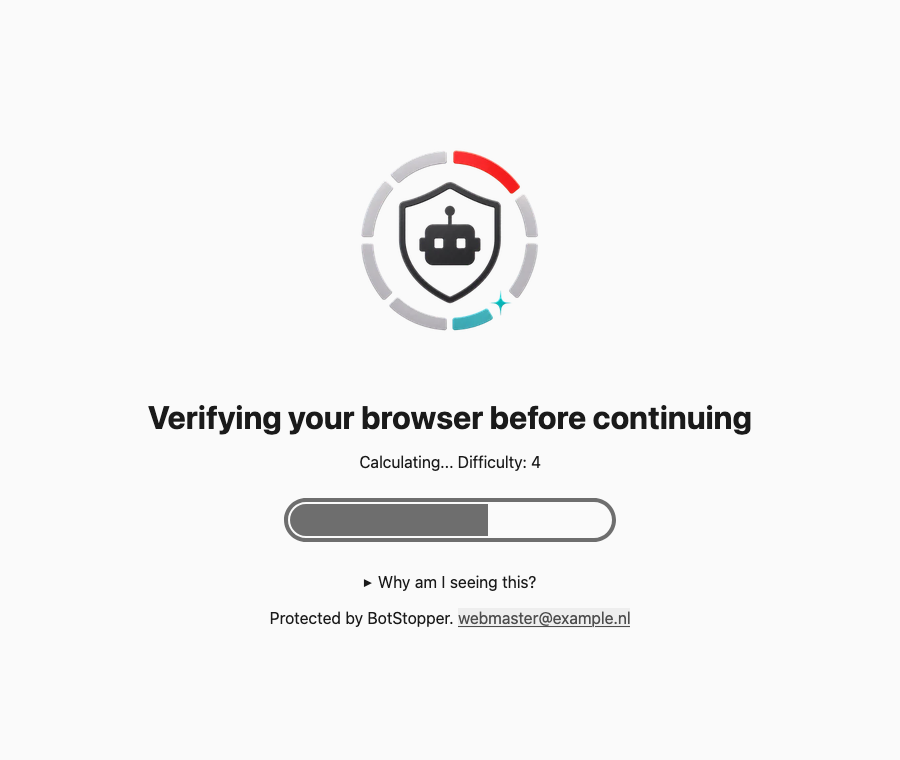
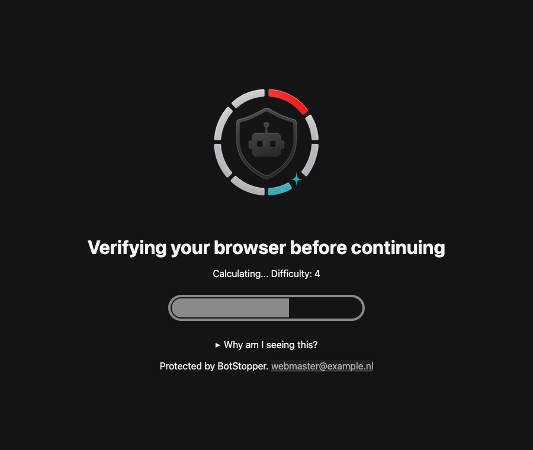
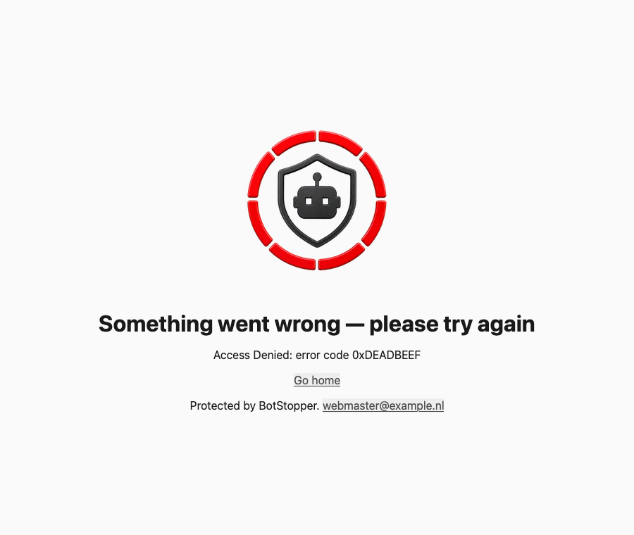
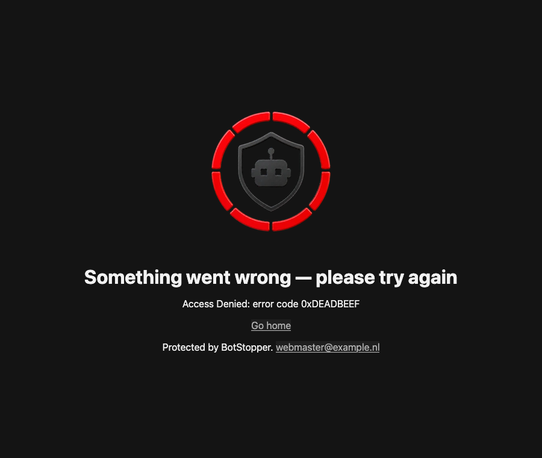
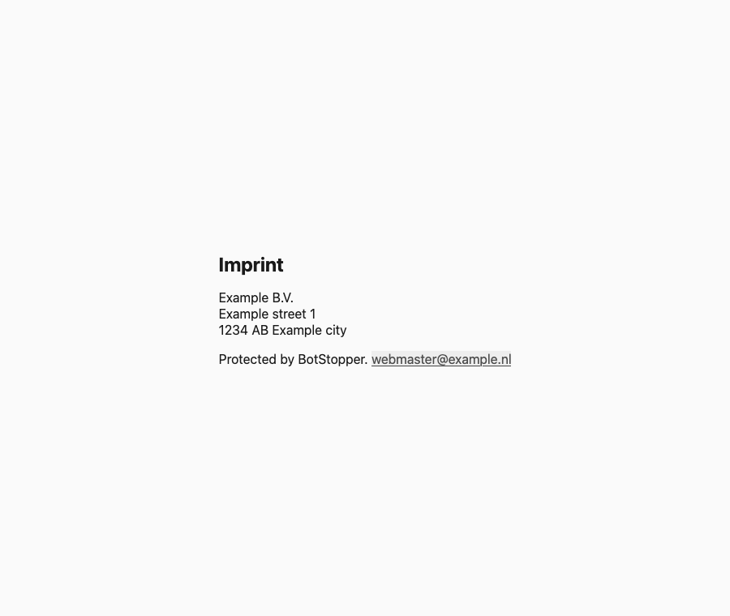
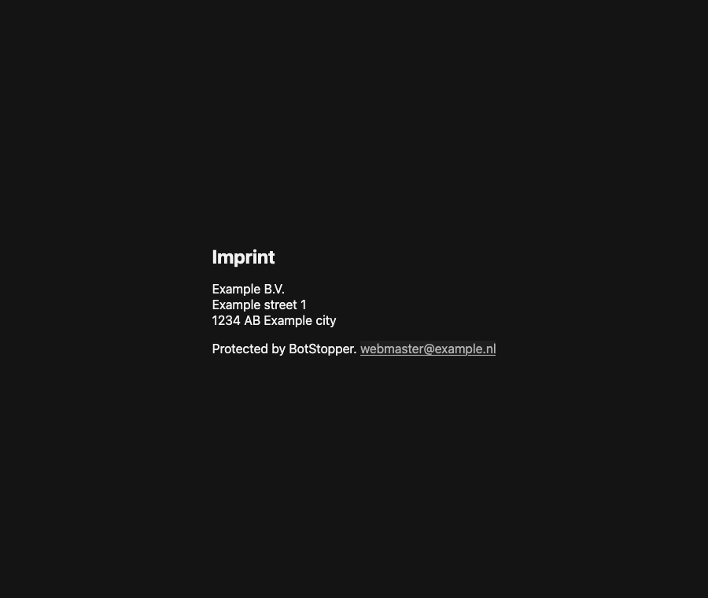
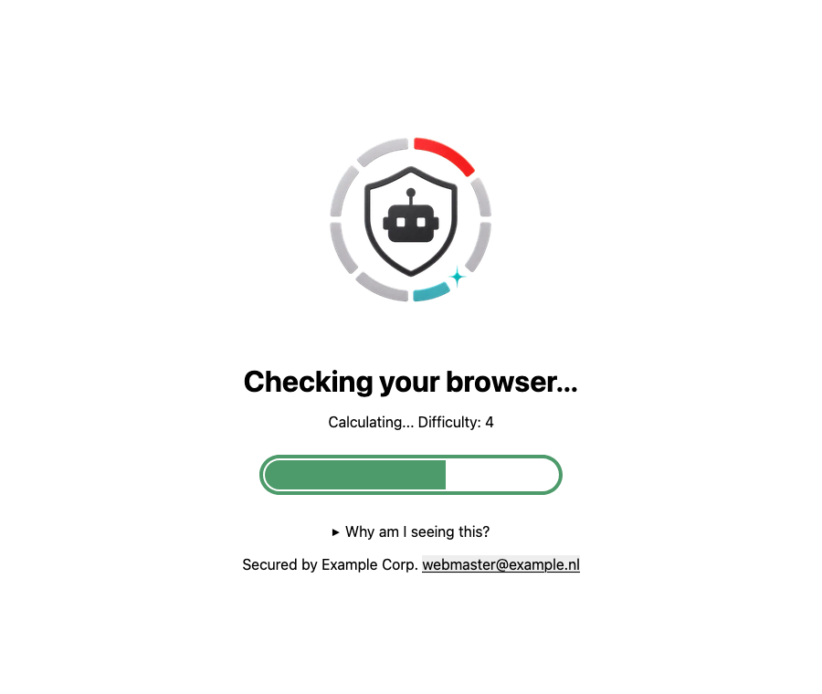

# Anubis: Custom Appearance and HTML Templates

This document explains how `ansible-role-anubis` changes the look of the BotStopper challenge, error, and imprint pages. It covers the custom CSS theme, the state images, the page titles, and the custom HTML templates that replace BotStopper's built-in footer. It is self-contained, so you can share it without the main [README](README.md).

Out of scope: bot policies, cookies, ports, and HAProxy shared mode. See the README for those.

## At a glance

| Page      | Template file    | Shown when                                           | Image          |
| --------- | ---------------- | ---------------------------------------------------- | -------------- |
| Challenge | `challenge.tmpl` | A visitor must solve the proof-of-work challenge.    | `pensive.webp`, then `happy.webp` on success |
| Error     | `error.tmpl`     | The request is denied or the challenge fails.        | `reject.webp` |
| Imprint   | `impressum.tmpl` | BotStopper serves its imprint (legal notice) page.   | none |

Every protected domain (instance) gets its own copy of these files. You can change all of them globally, or per domain.

## Previews

The screenshots below show the role's **default** templates and theme, rendered locally in Firefox. BotStopper normally fills in the `{{ .Body }}` part of each page at runtime. For these previews it was replaced by representative mock content, so the exact wording, progress bar, and details block can look slightly different on a live instance. The page shell, footer, colors, fonts, and images are the real role output. To regenerate the screenshots, see [Regenerating the previews](#regenerating-the-previews).

### Challenge page

| Light (default / no preference)                       | Dark (`prefers-color-scheme: dark`)                 |
| ----------------------------------------------------- | --------------------------------------------------- |
|  |  |

### Error page

| Light                                         | Dark                                        |
| --------------------------------------------- | ------------------------------------------- |
|  |  |

### Imprint page

| Light                                                 | Dark                                                |
| ----------------------------------------------------- | --------------------------------------------------- |
|  |  |

### Branded example

This is the challenge page with the theme, title, and footer overrides from [Example: brand one domain](#example-brand-one-domain):



## How it works

### Layers

The appearance is built from three layers. Each one depends on the layer above it:

1. **Overlay** (`overlay_managed`, default `true`). The role creates an overlay directory for the instance and points BotStopper's `OVERLAY_FOLDER` at it. It contains the custom CSS and the state images.
2. **Page titles** (`challenge_title`, `error_title`). These are set as the BotStopper environment variables `CHALLENGE_TITLE` and `ERROR_TITLE`. They do not depend on the overlay.
3. **HTML templates** (`templates_managed`, default `true`). These only apply when the overlay is also enabled. The role writes `challenge.tmpl`, `error.tmpl`, and `impressum.tmpl` into the overlay and sets `USE_TEMPLATES=true`.

### Why templates are needed

BotStopper's default page has one built-in footer. It says "Made with ❤️" and credits Anubis/Techaro, the mascot artist, and the running version. No setting changes only the footer text. The only way to remove or replace it is BotStopper's `USE_TEMPLATES` mechanism, which replaces the **entire** page HTML. The role's templates copy BotStopper's own page structure and swap the footer for `footer_text`. When `webmaster_email` is set, it is added as a mailto link.

### Files on the target host

For an instance named `example.nl`, with `anubis_config_dir` at its default of `/etc/techaro-botstopper`:

```text
/etc/techaro-botstopper/
├── example.nl.env                  # OVERLAY_FOLDER, CHALLENGE_TITLE, ERROR_TITLE, USE_TEMPLATES
└── example.nl.overlay/             # overlay_managed
    ├── static/
    │   ├── css/custom.css          # anubis_theme + anubis_theme_dark
    │   └── img/                    # overlay_images_dir (happy/pensive/reject.webp)
    └── templates/                  # templates_managed
        ├── challenge.tmpl
        ├── error.tmpl
        └── impressum.tmpl
```

### Decision logic

The role decides per instance what to write, using these rules:

| `overlay_managed` | `templates_managed` | `overlay_images_dir` | Result |
| ----------------- | ------------------- | -------------------- | ------ |
| `true`            | `true`              | set (default)        | CSS, images, and templates are written. `OVERLAY_FOLDER` and `USE_TEMPLATES=true` are set. This is the default. |
| `true`            | `true`              | `""`                 | CSS and templates are written. BotStopper's built-in images are kept. |
| `true`            | `false`             | any                  | CSS (and images) are written. The `templates/` directory is removed. `USE_TEMPLATES` is not set, so BotStopper's default footer is shown. |
| `false`           | any                 | any                  | The whole `<instance>.overlay` directory is removed. BotStopper runs with its built-in look. Page titles still apply. |

Any change to the CSS, images, or templates, and removing any of them, restarts **only** the affected instance. Overlay directories of instances that no longer exist are removed automatically.

### Two template languages in one file

The `.tmpl.j2` files are processed twice:

1. **Ansible (Jinja2)** renders them on the control host. It fills in the footer text, the webmaster email, and the shared base CSS (`_anubis_base_style.css.j2`).
2. **BotStopper (Go `html/template`)** renders the result for every request. It fills in `{{ .Lang }}`, `{{ .Head }}`, `{{ .Body }}`, and `{{ Asset "..." }}`.

Go template syntax uses the same `{{ }}` braces as Jinja2, so every Go part is wrapped in `…`. Anything outside a raw block is Jinja2.

| Go placeholder         | Filled in by BotStopper with                                                                     |
| ---------------------- | ------------------------------------------------------------------------------------------------ |
| `{{ .Lang }}`          | The language of the page.                                                                        |
| `{{ .Head }}`          | BotStopper's own `<head>` content: title, scripts, and stylesheets. Only `challenge.tmpl` uses it. |
| `{{ .Body }}`          | The page content: title, status, progress bar, and explanation, or the error message.            |
| `{{ Asset "<path>" }}` | The URL of a file in the overlay's `static/` directory, for example `css/custom.css`.            |

## Variables

All variables can be set globally (with the `anubis_` prefix) or per domain (without the prefix) on a domain entry in `users`. A per-domain value wins.

| Global variable                | Per-domain key       | Type | Default                                         | Description |
| ------------------------------ | -------------------- | ---- | ----------------------------------------------- | ----------- |
| `anubis_overlay_managed`       | `overlay_managed`    | bool | `true`                                          | Manage the overlay directory (CSS, images, templates). |
| `anubis_overlay_images_dir`    | `overlay_images_dir` | str  | `{{ role_path }}/files/overlay-images`          | Directory on the Ansible control host with replacement images. Use `""` to keep BotStopper's built-in images. |
| `anubis_theme`                 | `theme`              | dict | neutral grey (light)                            | CSS custom properties for the base theme (light, or no preference). |
| `anubis_theme_dark`            | `theme_dark`         | dict | neutral grey (dark)                             | CSS custom properties applied inside `@media (prefers-color-scheme: dark)`. |
| `anubis_challenge_title`       | `challenge_title`    | str  | `"Verifying your browser before continuing"`    | Title of the challenge page. |
| `anubis_error_title`           | `error_title`        | str  | `"Something went wrong — please try again"`     | Title of the error page. |
| `anubis_templates_managed`     | `templates_managed`  | bool | `true`                                          | Manage the HTML templates and set `USE_TEMPLATES=true`. Requires `overlay_managed`. |
| `anubis_footer_text`           | `footer_text`        | str  | `"Protected by BotStopper."`                    | Footer text that replaces BotStopper's built-in credits. |
| `anubis_webmaster_email`       | `webmaster_email`    | str  | empty                                           | When set, added to the footer as a mailto link. It is also passed to BotStopper as `WEBMASTER_EMAIL`. |

Per-domain `theme` and `theme_dark` values are **merged** into the global dicts, so you only need to list the properties you want to change.

## Custom CSS

### Theme properties

BotStopper's page styles read these CSS custom properties. The role's templates use the same properties, with the fallback values shown here:

| Property                    | Used for                           | Fallback in the templates |
| --------------------------- | ---------------------------------- | ------------------------- |
| `--background`              | Page background                    | `#fafafa` |
| `--text`                    | Body text                          | `#1a1a1a` |
| `--body-sans-font`          | Body font stack                    | system sans-serif stack |
| `--body-title-font`         | Heading font stack                 | `--body-sans-font` |
| `--body-preformatted-font`  | `<pre>` font stack                 | `monospace` |
| `--preformatted-background` | `<pre>` background                 | `#eeeeee` |
| `--progress-bar-fill`       | Progress bar fill                  | `#6e6e6e` |
| `--progress-bar-outline`    | Progress bar ring (CSS `outline`)  | `#6e6e6e solid 4px` |
| `--link-foreground`         | Link text color                    | `inherit` |
| `--link-background`         | Link background                    | `transparent` |
| `--text-selection`          | Text selection highlight           | `#d0d0d0` |

> [!IMPORTANT]
> BotStopper's own theme sets `--progress-bar-outline`, `--link-foreground`, and `--text-selection` to a purple/pink accent, independently of `--progress-bar-fill`. When you change the accent color, override all four together. Otherwise the progress ring, links, and text selection stay purple.

### Default theme

The role ships a neutral grey theme with a system font stack. It is deliberately unbranded, because the challenge page is shown to visitors of many unrelated domains. From `defaults/main.yml`:

```yaml
anubis_theme:
  "--background": "#fafafa"
  "--text": "#1a1a1a"
  "--progress-bar-fill": "#6e6e6e"
  "--progress-bar-outline": "#6e6e6e solid 4px"
  "--link-foreground": "#4d4d4d"
  "--link-background": "#eeeeee"
  "--text-selection": "#d0d0d0"
  "--body-sans-font": "-apple-system, BlinkMacSystemFont, 'Segoe UI', Roboto, Helvetica, Arial, sans-serif"
  "--body-title-font": "-apple-system, BlinkMacSystemFont, 'Segoe UI', Roboto, Helvetica, Arial, sans-serif"
  "--body-preformatted-font": "'SFMono-Regular', Consolas, 'Liberation Mono', Menlo, monospace"
anubis_theme_dark:
  "--background": "#141414"
  "--text": "#f2f2f2"
  "--progress-bar-fill": "#8a8a8a"
  "--progress-bar-outline": "#8a8a8a solid 4px"
  "--link-foreground": "#b3b3b3"
  "--link-background": "#1f1f1f"
  "--text-selection": "#4a4a4a"
```

### Template: `custom.css.j2`

The role merges the global dict with the per-domain dict and writes one `:root` block. The dark block is only written when `theme_dark` is not empty.

```jinja
/* {{ ansible_managed }} */


:root {

  {{ name }}: {{ value }};

}

@media (prefers-color-scheme: dark) {
  :root {

    {{ name }}: {{ value }};

  }
}

```

### Rendered: `static/css/custom.css`

This is the output with the default theme:

```css
/* Ansible managed */
:root {
  --background: #fafafa;
  --text: #1a1a1a;
  --progress-bar-fill: #6e6e6e;
  --progress-bar-outline: #6e6e6e solid 4px;
  --link-foreground: #4d4d4d;
  --link-background: #eeeeee;
  --text-selection: #d0d0d0;
  --body-sans-font: -apple-system, BlinkMacSystemFont, 'Segoe UI', Roboto, Helvetica, Arial, sans-serif;
  --body-title-font: -apple-system, BlinkMacSystemFont, 'Segoe UI', Roboto, Helvetica, Arial, sans-serif;
  --body-preformatted-font: 'SFMono-Regular', Consolas, 'Liberation Mono', Menlo, monospace;
}
@media (prefers-color-scheme: dark) {
  :root {
    --background: #141414;
    --text: #f2f2f2;
    --progress-bar-fill: #8a8a8a;
    --progress-bar-outline: #8a8a8a solid 4px;
    --link-foreground: #b3b3b3;
    --link-background: #1f1f1f;
    --text-selection: #4a4a4a;
  }
}
```

### Base page styles: `_anubis_base_style.css.j2`

All three HTML templates include this file inline in a `<style>` block. It recreates BotStopper's layout (centered column, progress bar, links) using the theme properties above. `error.tmpl` and `impressum.tmpl` do not load BotStopper's `{{ .Head }}`, so this block keeps them styled the same as the challenge page.

```css
body, html {
  height: 100%;
  display: flex;
  justify-content: center;
  align-items: center;
  margin: 0;
  background: var(--background, #fafafa);
  color: var(--text, #1a1a1a);
  font-family: var(--body-sans-font, -apple-system, BlinkMacSystemFont, "Segoe UI", Roboto, Helvetica, Arial, sans-serif);
}
main {
  max-width: 50rem;
  padding: 2rem;
  margin: auto;
}
::selection {
  background: var(--text-selection, #d0d0d0);
}
.centered-div {
  text-align: center;
}
#status {
  font-variant-numeric: tabular-nums;
}
#progress {
  display: none;
  width: min(20rem, 90%);
  height: 2rem;
  border-radius: 1rem;
  overflow: hidden;
  margin: 1rem 0 2rem;
  outline-offset: 2px;
  outline: var(--progress-bar-outline, #6e6e6e solid 4px);
}
.bar-inner {
  background-color: var(--progress-bar-fill, #6e6e6e);
  height: 100%;
  width: 0;
  transition: width 0.25s ease-in;
}
pre {
  background-color: var(--preformatted-background, #eeeeee);
  padding: 1em;
  border: 0;
  font-family: var(--body-preformatted-font, monospace);
}
a, a:active, a:visited {
  color: var(--link-foreground, inherit);
  background-color: var(--link-background, transparent);
}
h1, h2, h3, h4, h5 {
  margin-bottom: 0.1rem;
  font-family: var(--body-title-font, var(--body-sans-font, sans-serif));
}
img {
  max-width: 100%;
}
footer {
  text-align: center;
}
```

## State images

`overlay_images_dir` points to a directory **on the Ansible control host**. The role copies its files into the instance's `static/img/` directory. It recognizes these files, placed directly in the directory (no subdirectories):

| File           | Shown on                              |
| -------------- | ------------------------------------- |
| `pensive.webp` | Challenge page, while solving         |
| `happy.webp`   | Challenge page, after success         |
| `reject.webp`  | Error page                            |

The role's bundled directory (`files/overlay-images/`) replaces all three. If a directory only contains some of the files, BotStopper's built-in images are used for the others. The templates load images through `{{ Asset "img/<name>.webp" }}`.

## HTML templates

The three templates share the same structure:

- A Jinja2 `ansible_managed` comment.
- A Go `html/template` page shell, wrapped in ``.
- The inlined base CSS.
- A Jinja2-rendered footer.

### `challenge.tmpl.j2`

`challenge.tmpl` is the only template that includes BotStopper's `{{ .Head }}`. That is where the proof-of-work JavaScript is loaded, so do not remove it. The second, hidden `` preloads `happy.webp`, so the success image appears straight away.

```jinja
<!-- {{ ansible_managed }} -->
<!DOCTYPE html>
<html lang="{{ .Lang }}">
  <head>
    {{ .Head }}
    <link rel="stylesheet" href='{{ Asset "css/custom.css" }}'/>
    <style>


    </style>
  </head>
  <body>
    <main>
    <div class="centered-div">
      
      
    </div>
    {{ .Body }}
    <footer style="text-align:center">
      <p>
        {{ instance.footer_text | default(anubis_footer_text) }}
        
        <a href="mailto:{{ instance.webmaster_email | default(anubis_webmaster_email) }}">{{ instance.webmaster_email | default(anubis_webmaster_email) }}</a>
        
      </p>
    </footer>
    </main>
  </body>
</html>

```

### `error.tmpl.j2`

This template builds its own minimal `<head>`, without `{{ .Head }}`. BotStopper's example error template has no `<head>` at all. With its own `<head>`, the error page follows `anubis_theme` regardless of what BotStopper puts in the challenge page's head.

```jinja
<!-- {{ ansible_managed }} -->
<!DOCTYPE html>
<html lang="{{ .Lang }}">
  <head>
    <link rel="stylesheet" href='{{ Asset "css/custom.css" }}'/>
    <style>


    </style>
  </head>
  <body>
    <main>
    <div class="centered-div">
      
    </div>
    {{ .Body }}
    <footer style="text-align:center">
      <p>
        {{ instance.footer_text | default(anubis_footer_text) }}
        
        <a href="mailto:{{ instance.webmaster_email | default(anubis_webmaster_email) }}">{{ instance.webmaster_email | default(anubis_webmaster_email) }}</a>
        
      </p>
    </footer>
    </main>
  </body>
</html>

```

### `impressum.tmpl.j2`

This is the same shell as `error.tmpl`, without an image. It makes sure BotStopper's imprint page also shows the custom footer instead of the built-in credits. The imprint content comes from BotStopper through `{{ .Body }}`. This role does not set it.

```jinja
<!-- {{ ansible_managed }} -->
<!DOCTYPE html>
<html lang="{{ .Lang }}">
  <head>
    <link rel="stylesheet" href='{{ Asset "css/custom.css" }}'/>
    <style>


    </style>
  </head>
  <body>
    <main>
    {{ .Body }}
    <footer style="text-align:center">
      <p>
        {{ instance.footer_text | default(anubis_footer_text) }}
        
        <a href="mailto:{{ instance.webmaster_email | default(anubis_webmaster_email) }}">{{ instance.webmaster_email | default(anubis_webmaster_email) }}</a>
        
      </p>
    </footer>
    </main>
  </body>
</html>

```

### Rendered footer

With `anubis_footer_text: "Protected by BotStopper."` and `anubis_webmaster_email: webmaster@example.nl`, Ansible writes this footer into every template:

```html
<footer style="text-align:center">
  <p>
    Protected by BotStopper.
    <a href="mailto:webmaster@example.nl">webmaster@example.nl</a>
  </p>
</footer>
```

When `webmaster_email` is empty, only the text is written.

### Rendered environment

These are the lines in `<instance>.env` that come from these settings:

```shell
WEBMASTER_EMAIL=webmaster@example.nl
OVERLAY_FOLDER=/etc/techaro-botstopper/example.nl.overlay
CHALLENGE_TITLE=Verifying your browser before continuing
ERROR_TITLE=Something went wrong — please try again
USE_TEMPLATES=true
```

## Examples

### Example: change the footer everywhere

```yaml
anubis_footer_text: "Protected by BotStopper on behalf of the site owner."
anubis_webmaster_email: abuse@example.nl
```

### Example: brand one domain

This produces the [branded preview](#branded-example). Only the listed properties change. The rest of the default theme is kept through the merge.

```yaml
users:
  - name: example_prd
    managed_challenge: true
    domains:
      - name: example.nl
        challenge_title: "Checking your browser..."
        footer_text: "Secured by Example Corp."
        theme:
          "--background": "#ffffff"
          "--text": "#000000"
          "--progress-bar-fill": "#4d9a6a"
          "--progress-bar-outline": "#4d9a6a solid 4px"
          "--link-foreground": "#000000"
          "--text-selection": "#4d9a6a"
        theme_dark:
          "--background": "#000000"
          "--text": "#ffffff"
          "--link-foreground": "#ffffff"
```

### Example: light theme only

The dark block is only written when the merged `theme_dark` is not empty. Setting the global dict to `{}` makes every visitor see the base theme, whatever their OS setting.

```yaml
anubis_theme_dark: {}
```

### Example: custom state images for one domain

```yaml
domains:
  - name: example.nl
    overlay_images_dir: /path/on/control/host/example-nl-images   # contains happy.webp, pensive.webp, reject.webp
```

To keep BotStopper's built-in images but still use the custom CSS and templates:

```yaml
domains:
  - name: example.nl
    overlay_images_dir: ""
```

### Example: keep BotStopper's default footer

```yaml
domains:
  - name: legacy.nl
    templates_managed: false   # custom CSS stays, built-in page HTML and footer return
```

### Example: disable all customization for a domain

```yaml
domains:
  - name: vanilla.nl
    overlay_managed: false     # removes <instance>.overlay; BotStopper's built-in look
```

### Example: company-wide brand in group vars

```yaml
# group_vars/customer_x.yml
anubis_theme:
  "--background": "#0b1f3a"
  "--text": "#f5f7fa"
  "--progress-bar-fill": "#f5a623"
  "--progress-bar-outline": "#f5a623 solid 4px"
  "--link-foreground": "#f5a623"
  "--link-background": "transparent"
  "--text-selection": "#f5a623"
  "--body-sans-font": "Inter, -apple-system, 'Segoe UI', Roboto, sans-serif"
anubis_theme_dark: {}
anubis_challenge_title: "One moment, we are checking your browser"
anubis_footer_text: "Protected by Customer X."
```

> [!NOTE]
> Setting `anubis_theme` replaces the role's default dict completely. Unlike the per-domain `theme` key, it is not merged, so list every property you want. Web fonts such as `Inter` are only used when the visitor has them installed. The templates do not load any external fonts.

## Changing the templates

The role does not offer a variable to supply your own template file. To change the HTML itself:

1. Edit `templates/challenge.tmpl.j2`, `error.tmpl.j2`, or `impressum.tmpl.j2` in the role. Put shared CSS in `_anubis_base_style.css.j2`.
2. Put any Go template syntax (`{{ .Something }}`, `{{ Asset "..." }}`) inside `…`. Otherwise Jinja2 tries to render it and the run fails.
3. Keep `{{ .Head }}` and `{{ .Body }}` in `challenge.tmpl`. Without them the challenge script does not load and visitors can never pass.
4. Reference new static files through `{{ Asset "css/…" }}` or `{{ Asset "img/…" }}`, and make sure the role puts them in the overlay's `static/` directory.
5. Run `molecule test`. `molecule/default` checks that the templates exist for every instance, except where `templates_managed` or `overlay_managed` is disabled.
6. Regenerate the screenshots in this document (see below) and update the template sources shown above.

### Regenerating the previews

[`render_previews.py`](render_previews.py) renders the templates with the values from `defaults/main.yml` and screenshots each page with headless Firefox into `docs/images/`. It needs Python 3 with PyYAML and Jinja2, and Firefox. Run it from the role directory:

```shell
python3 docs/render_previews.py

# When Firefox is not in /Applications or on the PATH
FIREFOX=/path/to/firefox python3 docs/render_previews.py
```

The script works like this:

- It uses Jinja2 with `trim_blocks`, like Ansible, and a simple stand-in for `ansible.builtin.combine`.
- It replaces BotStopper's Go placeholders with fixed values. `{{ .Body }}` becomes mock content, and `{{ Asset "..." }}` becomes a relative path to a local copy of the overlay.
- Headless Firefox cannot be forced into a color scheme. For the dark screenshots, the script merges `theme_dark` into the base theme and leaves out the `@media` block. The screenshots therefore don't depend on the OS setting.
- The branded screenshot uses the `BRANDED_DOMAIN` overrides at the top of the script. Keep them in sync with [Example: brand one domain](#example-brand-one-domain).

## Checking a live instance

```shell
# Which appearance settings the instance got
grep -E 'OVERLAY_FOLDER|USE_TEMPLATES|CHALLENGE_TITLE|ERROR_TITLE|WEBMASTER_EMAIL' /etc/techaro-botstopper/example.nl.env

# The files BotStopper serves
find /etc/techaro-botstopper/example.nl.overlay -type f

# The footer that was written
grep -A4 '<footer' /etc/techaro-botstopper/example.nl.overlay/templates/challenge.tmpl

# Restart one instance by hand (the role does this automatically when files change)
systemctl restart botstopper@example.nl
```

If the page still shows the purple accent, check `--progress-bar-outline`, `--link-foreground`, and `--text-selection` (see [Theme properties](#theme-properties)). If the "Made with ❤️" footer is still visible, `USE_TEMPLATES=true` is missing from the `.env` file. Check that both `overlay_managed` and `templates_managed` are enabled for that domain.
